# Reto UX-2

### Elementos de navegación de los siguientes sites:

## **Breather**

1. Facetada:

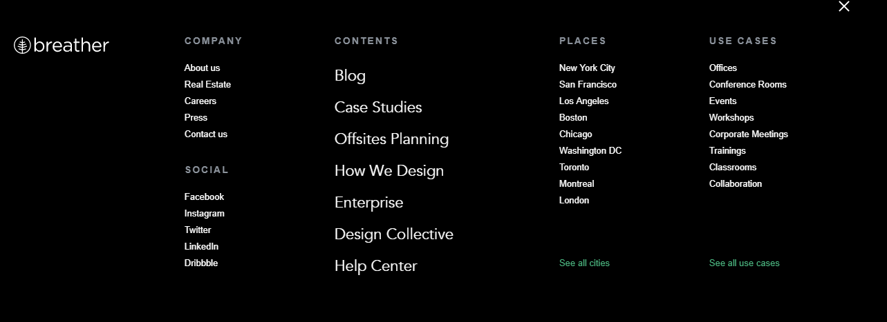

2. Filtrada:

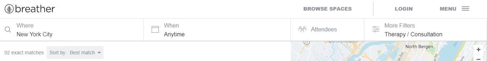
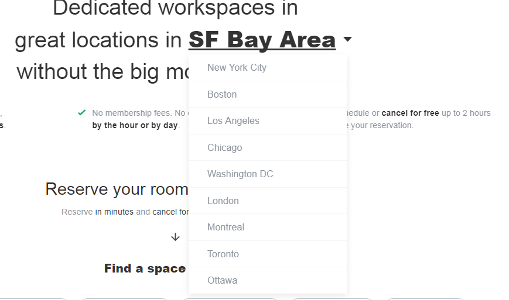

3. Contextual:

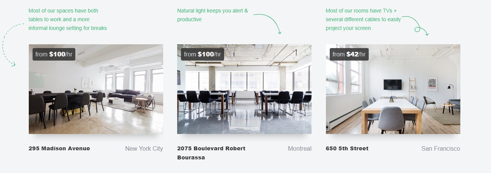

4. Inline:

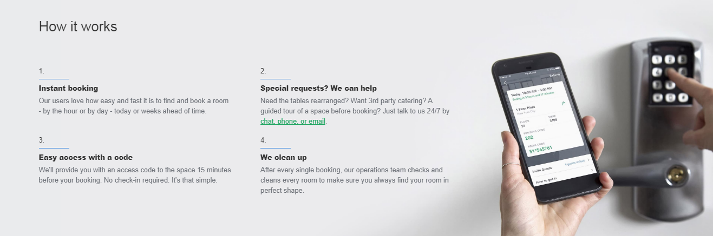

## **Git Hub**

1. Global:

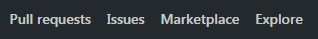

2. Local:

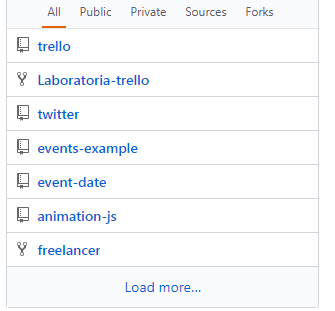

3. Facetada:

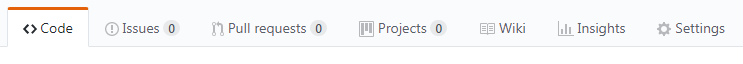

4. Inline:

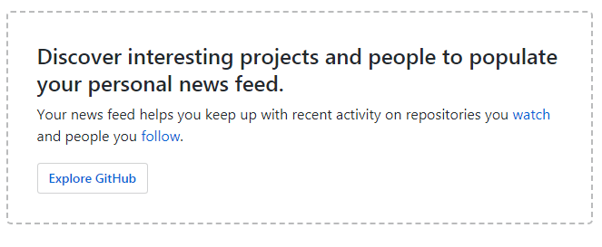

## **Medium**

1. Global:

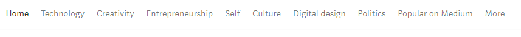

2. Local:

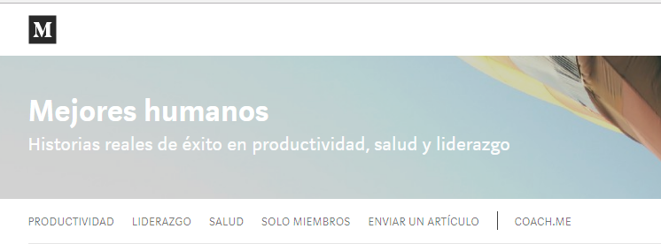

3. Contextual:

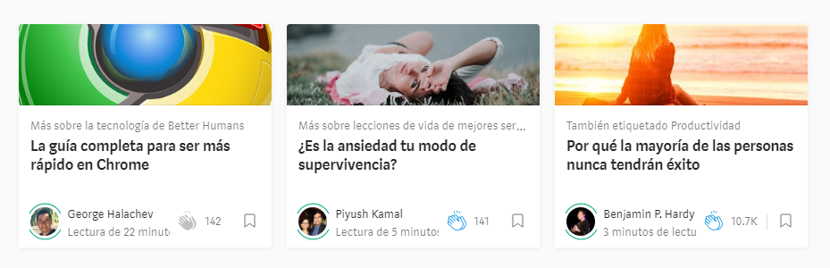

4. Suplementaria:

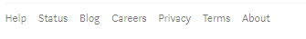
